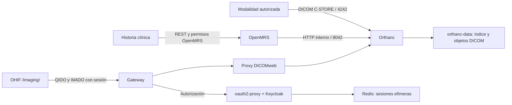

# Imágenes médicas en SIH Salus

Este subsistema guarda DICOM en Orthanc y muestra los estudios con OHIF. OpenMRS
mantiene las solicitudes y la asociación con el paciente. No existe un importador
FTP en esta distribución: dejar archivos en un FTP no los incorpora a la historia.

## Estado y límites de la puesta en marcha

La configuración del repositorio no demuestra que un servidor esté operativo.
Antes de habilitarlo se necesitan un destino DEV/QLTY autorizado, imágenes
construidas por CI, el módulo `imaging` iniciado y una conexión Orthanc registrada
en OpenMRS. La aceptación usa exclusivamente estudios y pacientes sintéticos.

El frontend actualizado acepta DICOM individuales. ZIP permanece deshabilitado:
el contrato de carga de `imaging` 1.2.8 interpreta una respuesta por estudio, mientras
que Orthanc devuelve una lista al recibir un archivo ZIP. La versión 1.2.9 preparada
en `sihsalus/openmrs-module-imaging` requiere su propio CI, revisión y publicación;
no es todavía el artefacto fijado en `backend/pom.xml`. La distribución conserva
1.2.8 hasta que exista un reemplazo publicado y verificable.

La lista de trabajo de modalidades y su notificación de finalización requieren
además un puente Orthanc–OpenMRS. Este profile **no instala ese puente**. No habilitar
el script histórico sin validar su gestión de credenciales, reintentos persistentes,
identidad del paciente y recuperación después de una caída. Crear una solicitud en
la SPA no demuestra que una modalidad pueda consultarla por C-FIND.

## Flujo y persistencia



Los archivos residen en `orthanc-data`, montado en `/var/lib/orthanc/db`. Las
referencias al paciente y las solicitudes residen en MariaDB/OpenMRS. Respaldar
solo MariaDB no respalda las imágenes; respaldar solo Orthanc no conserva las
asociaciones clínicas de OpenMRS.

## Configuración del entorno

Usar el mismo archivo de entorno y las mismas composiciones del destino aprobado.
Ejemplo para un entorno de desarrollo aislado; en DEV/QLTY sustituir las URLs por
el origen real coordinado:

```env
COMPOSE_FILE=docker-compose.yml:compose/keycloak.yml:compose/imaging-auth.yml
COMPOSE_PROFILES=keycloak,imaging
IMAGING_OIDC_CLIENT_SECRET=<secreto-del-cliente-keycloak>
IMAGING_OAUTH_COOKIE_SECRET=<base64-de-32-bytes>
IMAGING_REDIS_PASSWORD=<secreto-independiente-de-48-caracteres-hexadecimales>
IMAGING_OAUTH_REDIRECT_URI=http://localhost/imaging/oauth2/callback
IMAGING_OAUTH_COOKIE_SECURE=false
```

En HTTPS añadir `compose/ssl.yml`, usar una callback HTTPS exacta y establecer
`IMAGING_OAUTH_COOKIE_SECURE=true`. Revisar también `KC_HOSTNAME` y
`KEYCLOAK_PUBLIC_URL`; el esquema y el puerto público deben conservarse hasta
Orthanc para que las URL de recuperación de imágenes sean correctas.

Si OpenMRS debe conservar su login local, añadir `compose/openmrs-local-auth.yml`
después de `compose/keycloak.yml`, manteniendo `compose/imaging-auth.yml` y los
profiles actuales. El override conserva la ACL, el rol `imaging-access` y las
sesiones OIDC de Imaging. Ver [compatibilidad, orden y transición de autenticación](../keycloak/README.md#openmrs-local-con-keycloak-para-imaging)
antes de aplicarlo a un entorno existente.

OHIF se construye con [Dockerfile](Dockerfile) desde un commit y checksum fijos.
`PUBLIC_URL=/imaging/` queda compilado en los bundles y los workers; cambiar solo
`routerBasename` no sirve para relocalizar una imagen upstream compilada en `/`.
El build usa la minificación de producción y alinea `PUBLIC_URL` y `APP_CONFIG`
con el archivo `.env` de OHIF, conservando el resto de su configuración. CI verifica
el runtime minificado y los binarios WASM referenciados por sus archivos JavaScript.
La imagen conserva el service worker de OpenMRS y no registra otro para el visor.
Los cambios de `app-config.js` requieren reconstruir OHIF. No sustituir esta imagen
por `ohif/app` sin repetir las pruebas del contrato de assets y de navegador.

Las sondas verifican Keycloak listo, Orthanc y el plugin DICOMweb disponibles, y
los assets del visor. No consultan pacientes y no certifican por sí solas que una
imagen se pueda renderizar. La compilación de Keycloak habilita health antes de
su arranque `--optimized`.

## Conexión OpenMRS–Orthanc

Con una cuenta autorizada para `Task: Manager Orthanc Configuration` y lectura de
imágenes, comprobar primero la sesión, el módulo iniciado y
`GET /openmrs/ws/rest/v1/imaging/configurations`. No crear conexiones duplicadas.

La conexión del despliegue habitual debe tener:

| Campo | Valor |
| --- | --- |
| `orthancBaseUrl` | `http://orthanc:8042`, accesible desde el contenedor OpenMRS |
| `orthancProxyUrl` | Origen público real, incluido su puerto, seguido de `/orthanc` |
| `orthancUsername` / `orthancPassword` | Vacíos en este profile: la autenticación web termina en el gateway |

Si no existe, el administrador puede crearla mediante
`POST /openmrs/ws/rest/v1/imaging/configurations` con esos campos JSON, verificarla
con otro GET y registrar el ID devuelto. El ID es asignado por la base de datos:
no se debe asumir que sea `1`. Si existe una conexión con el mismo backend pero
otro proxy público, revisar y corregir su configuración existente; no añadir otra
para ocultar el problema.

El frontend solo abre el OHIF local cuando el proxy explícito del estudio coincide
con el origen actual y `/orthanc`. No sustituye silenciosamente un PACS desconocido
por otro servidor. Las credenciales internas nunca se entregan al navegador.

El límite de carga de OpenMRS es `imaging.maxUploadImageDataSize`, expresado en bytes.
El formulario permite hasta 200 000 000 bytes por archivo. El gateway reserva
`200m` exclusivamente para `/openmrs/ws/rest/v1/imaging/instances`; las demás rutas
conservan su límite. El módulo 1.2.9 reaplica el límite del parser compartido en
cada refresh del contexto OpenMRS y añade 64 KiB para el multipart del formulario.
El controlador mantiene el límite exacto del archivo. Aumentar la propiedad global
requiere refresh/reinicio y revisar también el límite del gateway. Esto conserva
el alcance global preexistente del parser, que actúa antes de autenticación;
no configura un segundo parser por petición. Un timeout puede ocurrir después de almacenar una
instancia: verificar el estudio antes de volver a cargarlo, sin borrados compensatorios.

## Autenticación, permisos y realms existentes

Sin `compose/imaging-auth.yml`, las rutas web quedan cerradas. Con el override se
requieren simultáneamente la ACL de red y el rol Keycloak `imaging-access`:

```env
IMAGING_NETWORK_ACCESS_CONTROL=allow 127.0.0.1; allow 10.0.0.0/8; allow 172.16.0.0/12; allow 192.168.0.0/16; deny all;
```

Usar rangos clínicos concretos o VPN y terminar siempre con `deny all;`. No publicar
los puertos internos de Orthanc, OHIF o Redis en la LAN. La visualización del PACS
no sustituye los privilegios de lectura, carga, borrado y asociación del módulo
OpenMRS. Las escrituras clínicas pasan por OpenMRS; las rutas web del PACS admiten
lectura y las consultas POST de búsqueda explícitamente permitidas.

`imaging-session-store` conserva sesiones OIDC cifradas y con TTL, sin RDB/AOF ni
volumen persistente. El navegador recibe un ticket pequeño. Reiniciar Redis exige
volver a iniciar sesión y no altera estudios ni solicitudes. Si Redis no está
disponible o alcanza su límite, el acceso falla cerrado. La migración a la cookie
`_sihsalus_imaging_session` exige un nuevo login a usuarios con una sesión antigua.
`/imaging/logout` cierra la sesión local y solicita el cierre OIDC en Keycloak.

**Importar el realm al arrancar no actualiza un realm existente.** En el destino
aprobado, respaldar su configuración y reconciliar únicamente el rol y el cliente
Imaging; no reemplazar el realm completo ni eliminar usuarios:

1. En el realm `openmrs`, comprobar o crear el realm role `imaging-access`.
2. Comprobar o crear el cliente `sihsalus-imaging` usando
   [realm-export.json](../keycloak/realm-export.json) como contrato. Debe ser
   confidencial, con Standard Flow y PKCE S256; sin Implicit Flow, password grants
   ni service accounts.
3. Configurar la callback exacta de ese entorno y sincronizar su secreto con
   `IMAGING_OIDC_CLIENT_SECRET` mediante el mecanismo privado de secretos. No
   exportar el secreto en evidencias, terminales compartidas o tickets.
4. Asignar el rol solo al personal autorizado. Verificar por separado un usuario
   permitido y uno autenticado sin ese rol.
5. Repetir la lectura de rol, cliente y callback: una segunda revisión no debe
   crear duplicados ni cambiar otros clientes. La rotación del secreto requiere
   coordinar también el reinicio de `imaging-auth`.

## Modalidades y lista de trabajo

C-STORE está limitado por defecto a localhost y al Called AET `ORTHANC`. Para una
modalidad autorizada, seleccionar la IP clínica concreta del host y restringir el
puerto en el firewall a las IP de esos equipos:

```env
DICOM_BIND_ADDRESS=192.168.10.5
DICOM_PORT=4242
```

Configurar en la modalidad esa IP, puerto `4242` y Called AET `ORTHANC`.
El login web no protege DIMSE. No cambiar `OverwriteInstances=false` para resolver
un conflicto de identidad.

La aceptación futura del puente de worklist debe verificar DA `yyyyMMdd`, TM
`HHmmss`, AE/SH de hasta 16 caracteres, `PatientID` igual al UUID OpenMRS y la
correspondencia de accession, solicitud y paso. La confirmación de una imagen
recibida no debe basarse solo en el número del paso ni en semejanza de nombres.
Los errores transitorios y conflictos de concurrencia requieren reintentos
recuperables. Los datos discrepantes requieren revisión clínica, sin reasignación
automática a otro paciente.

## Copia y restauración

Los scripts actuales de `scripts/backup/` cubren MariaDB, no Orthanc. Antes de uso
clínico, acordar retención, cifrado, capacidad y un procedimiento de restore para
ambos almacenes. No declarar un backup de imágenes válido solo porque un dump SQL
terminó correctamente.

Para una copia consistente de esta configuración SQLite, detener las escrituras
clínicas y Orthanc dentro de una ventana autorizada y respaldar conjuntamente el
índice y los objetos de `orthanc-data`. Usar snapshots coordinados con OpenMRS o
registrar el punto de corte de ambos backups. Copiar el volumen mientras Orthanc
escribe puede producir un respaldo inconsistente. Nunca ejecutar `down -v` como
paso de actualización o recuperación.

Restaurar primero en volúmenes nuevos y aislados, conservando los originales. Con
fixtures sintéticos verificar checksum del archivo DICOM, número de instancias,
QIDO/WADO, asociación OpenMRS y visualización de píxeles; después acordar cualquier
sustitución del almacenamiento operativo. No copiar estudios reales a CI ni a DEV.
Referencia: [backup de Orthanc](https://orthanc.uclouvain.be/book/users/backup.html).

## Evidencia necesaria antes de habilitarlo

| Capa | Evidencia requerida |
| --- | --- |
| CI distribución | Configuraciones HTTP/HTTPS, readiness, autorización, cierre de sesión y build real OHIF con contrato de assets |
| CI frontend | Unitarias, regresiones, tipos, lint y build del paquete de imágenes |
| CI módulo | API y OMOD, contratos DICOM, asociación y concurrencia; revisar migraciones antes de publicar 1.2.9 |
| DEV/QLTY sintético | Usuario permitido/denegado, carga DICOM, preview, QIDO/WADO y píxeles de un estudio normal y uno comprimido |
| Recuperación | Carga parcialmente aceptada, desconexión, expiración de sesión, reinicio de Orthanc/proxy/Redis y restore aislado |
| Modalidad | C-ECHO/C-STORE y, una vez integrado el puente, C-FIND y finalización con identidad verificada |

Los tests antiguos `e2e/patient-imaging` permanecen en cuarentena. Su limpieza no
puede sincronizar y borrar candidatos de un Orthanc compartido. Un futuro harness
debe registrar los recursos propios, comprobar su identidad sintética antes de
borrarlos y conservar el journal si una limpieza falla.

No se ejecutaron las pruebas del nuevo cambio localmente, por instrucción del
usuario. CI y aceptación del entorno deben registrar comando, estado, SHA,
versiones, rol sintético y resultado de limpieza. No adjuntar DICOM, tokens ni logs
con datos de pacientes a artefactos públicos.
